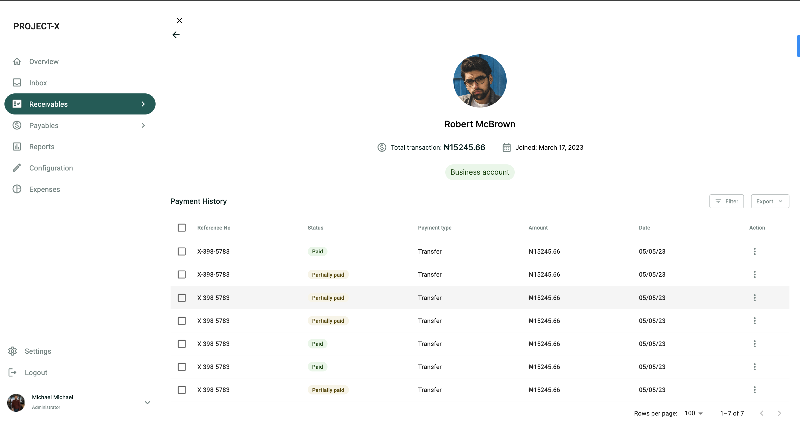
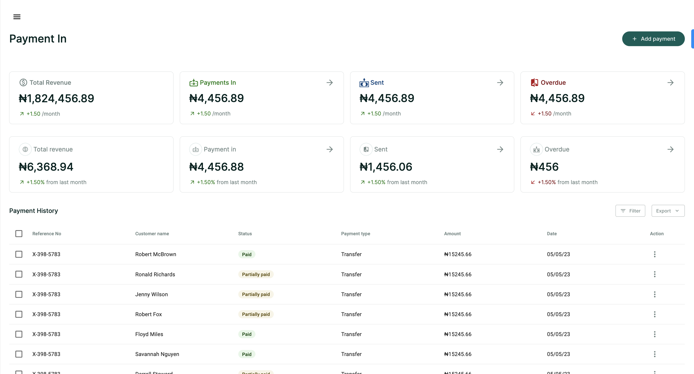

# Project Name

PROJECT-X

## Table of Contents

- [Description](#description)
- [Features](#features)
- [Live Demo](#LiveDemo)
- [Getting Started](#GettingStarted)
  - [Cloning the project](#Cloningtheproject)
  - [Getting packages and dependencies](#Gettingpackagesanddependencies)
  - [Building](#Building)
  - [Running](#Running)

## Description

PROJECT-X is a payment platform that allows users to view their payment transactions and add payments.





## Features

List the key features of your payment platform. This can include things like:

- User authentication and registration
- Payment processing
- Dashboard for users to manage their payments
- Reporting and analytics

## Live Demo

[Live demo](https://mathe-magic.netlify.app/)

## Getting Started

To get a local copy up and running follow these simple example steps.

### Cloning the project

```
git clone  https://github.com/kendoriddy/trooHQ.git <Your-Build-Directory>

```

```
cd <Your-Build-Directory>

```

### Getting packages and dependencies

To get all package modules required to build the project run:

```
npm install
```

every package module required to build the project is listed in the package.json file. this is used as a reference to get all dependencies.

### Building

To build the project run:

```
npm run build
```

after you run this successfully you'd locate the build from in the `build` folder located from the parent directory of the project.

### Running

To run the program on a browser through a server run this command in your cli

```
npm start
```

This should open the page in your localhost on port 3000. then you'd be able to view the built page generated using webpack.
